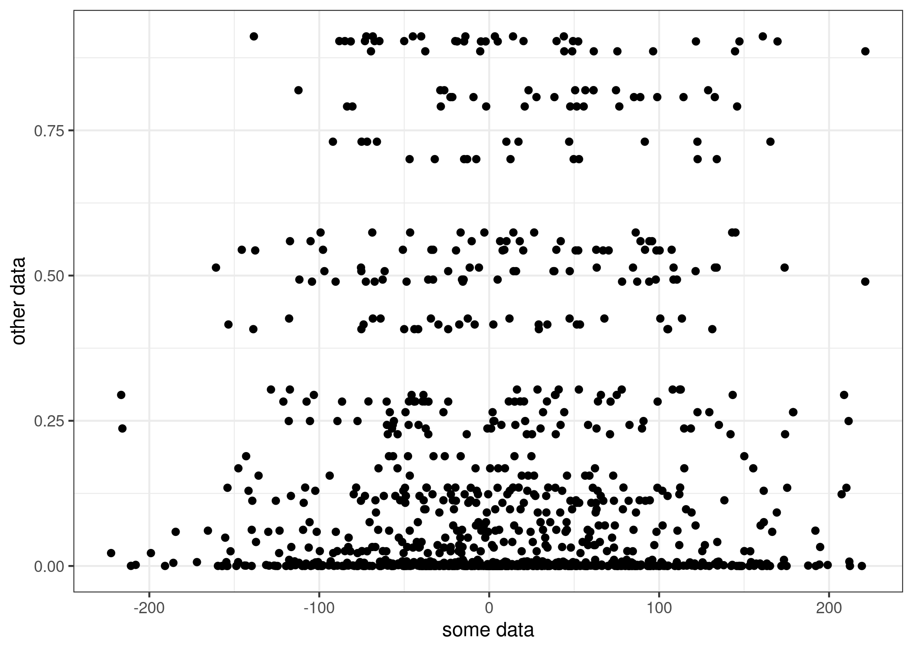

# This is a basic introduction to using RMarkdwon

In this course, we'll use `.R` and `.RMarkdown` files to submit assignments. 

To use the words of Martin John Hadley:

*RMarkdown creates a seamless workflow between data, analysis, and presentation. HTML RMarkdown documents can easily be published to the web and kept up-to-date. And using Shiny apps inside of the RMarkdown presentations, you can ensure that the data you're displaying is always up-to-date and correct. And finally, RMarkdown is incredibly simple to learn. There is one cheat sheet available at RStudio.com, which will teach you all you need to know.*

We want to make sure you're ready to use RMarkdown so you can feel comfortable working in it for all the assignments in this course. 

## RMarkdown Basics


If you already know this, you can skip this section! If you want a refresher, keep reading :). Refer to this [cheatsheet](https://www.rstudio.com/wp-content/uploads/2015/02/rmarkdown-cheatsheet.pdf) to refresh quickly. 

For our purposes you'll need to be able to do two main things: 

### 1. Write in Markdown

Plain text   
End a line with two spaces to start a new paragraph.   
*italics* and _italics_   
**bold** and __bold__   
superscript^2^   
~~strikethrough~~   
[link](www.rstudio.com)   

# Header 1   

## Header 2   

### Header 3   

#### Header 4   

##### Header 5   

###### Header 6   

endash: --   
emdash: ---   
ellipsis: ...   
inline equation: $A = \pi*r^{2}$   
image:   
  
horizontal rule (or slide break):  
*** 
> block quote   
* unordered list 
* item 2 
    + sub-item 1 
    + sub-item 2 
     
1. ordered list 
2. item 2 
    + sub-item 1 
    + sub-item 2 
Table Header  | Second Header 
------------- | ------------- 
Table Cell    | Cell 2        
Cell 3        | Cell 4 

### 2. Write Code Inline

```{r}
testing = 2+3
print(paste0("the value of `testing` is ", testing))

```
This includes making figures:
```{r}
plot(
     x = rnorm(100, 10, 20), 
     y = rnorm(100, 10, 20),
     type = "p",
     xlab = "Random Numbers",
     ylab = "More Random Numbers"
    )
```
It will also (very importantly) involve reading data into your RMarkdown document, doing some analyses, and then writing out some results. 

That will look something like this: 
```{r}
# I'll make some fake data for us to practice with
library(here)
library(tidyverse)

x = rnorm(1000, 12, 80)
y = rbeta(100, 0.2, 0.9)

data = data.frame(x, y)
write.csv(data, here("./data/test.csv"))

# now I'll read it back in and add a column
data = read.csv(here("./data/test.csv"))

data = data %>%
  mutate(z = x*y)

# now I'll make a plot, then save the plot
plot = ggplot(data = data) +
  geom_point(aes(x = x, y = y)) +
  labs(x = "some data", y  = "other data") +
  theme_bw()
#ggsave(here("./data/plot.png"), plot)

# now also write out the data
write.csv(data, here("./data/manipulated-data.csv"))

```
